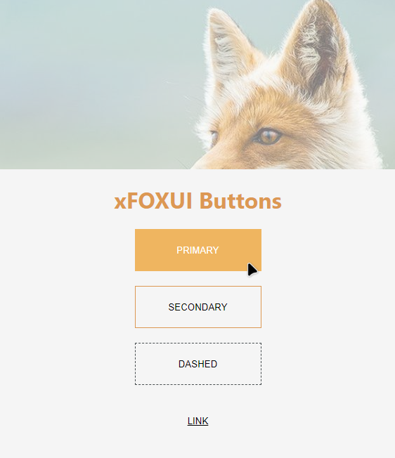
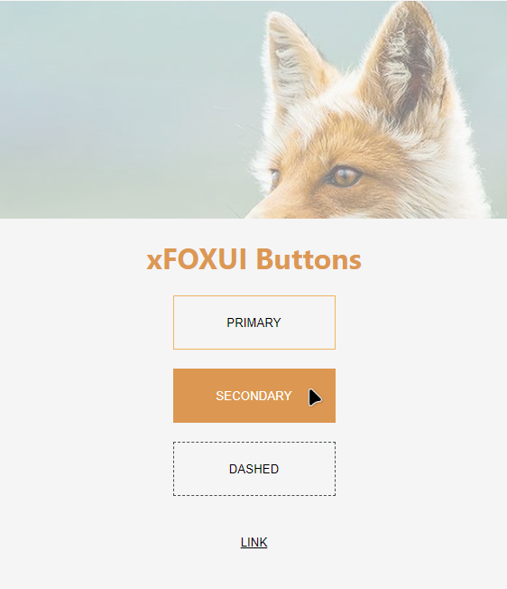
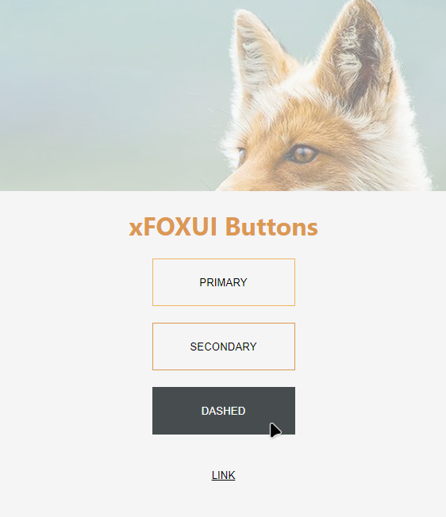
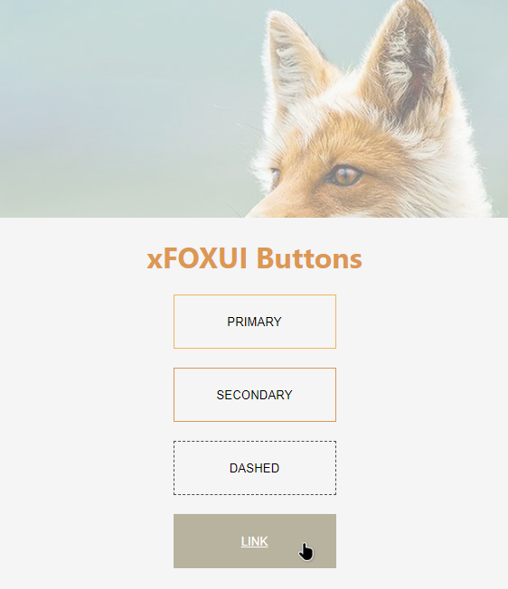

# xfoxui

> xFoxUI is a ReactUI library

[](https://www.npmjs.com/package/xfoxui) [](https://standardjs.com)

| [](screenshots/screenshot-1.png) | [](screenshots/screenshot-2.png) | [](screenshots/screenshot-3.png) | [](screenshots/screenshot-4.png) |
| ------------------------------------------------------------------------ | -------------------------------------------------------------------------- | ----------------------------------------------------------------------- | --------------------------------------------------------------------- |

## Install

```bash
yarn add xfoxui
```

## Usage

```jsx
import React, { Component } from 'react'

import {Button} from 'xfoxui'
import 'xfoxui/dist/index.css'

class Example extends Component {
  render() {
    return (
    <Button type='primary' text="PRIMARY" /> <br />
    <Button type='secondary' text="SECONDARY" /> <br />
    <Button type='dashed'  text="DASHED" /> <br />
    <Button type='link' text="LINK" /> <br />

    )
  }
}
```

## License

MIT © [mogretici](https://github.com/mogretici)
